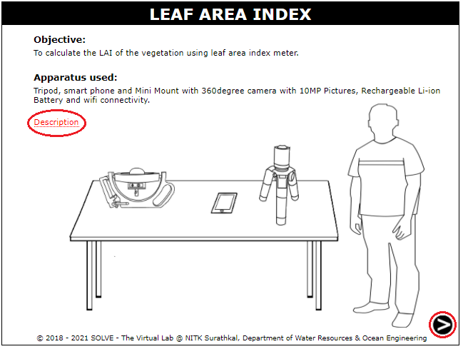
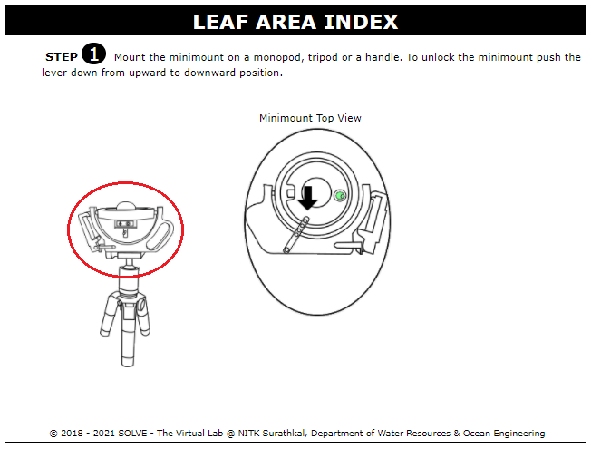
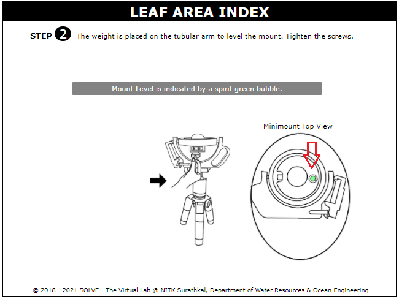
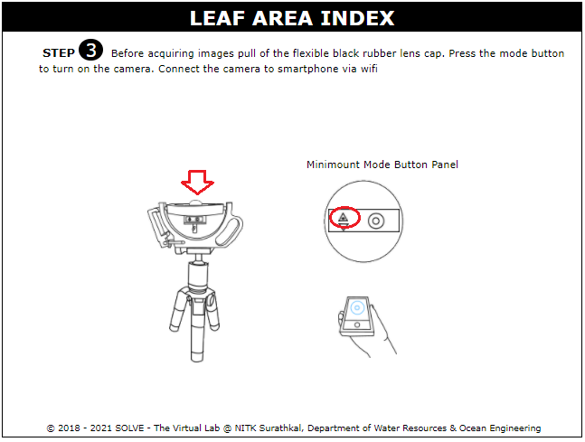
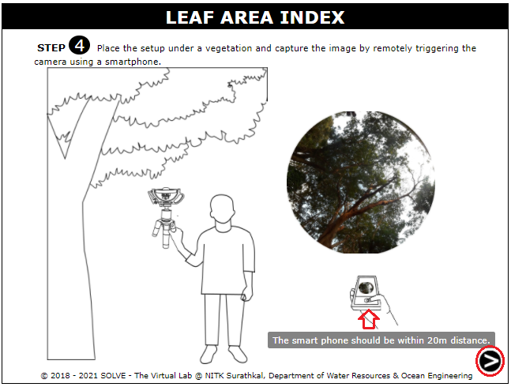
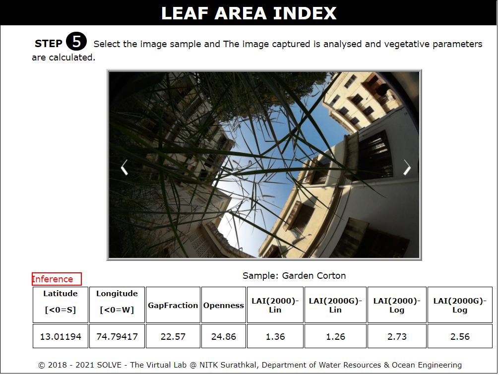

#### These procedure steps will be followed on the simulator

1. When you click on a Leaf Area Index file, a new window will open as shown below. Read the Description and Click Next.  
  

2. Click on the minimount to place it on the tripod, click on the lever to unlock the setup. Click on Next.  
  

3. Click on the weight and place it to level the mount. Click on Next.  
  

4. Click on the rubber lens cap before acquiring images, Click on the Mode button and connect the camera to a smartphone. Click on Next.  
  

5. Click the images of canopy using smartphone. Click on Next.  
  

6. Click through the gallery and select the vegetation whose Leaf Area Index is to be calculated. Read the inference.
  
